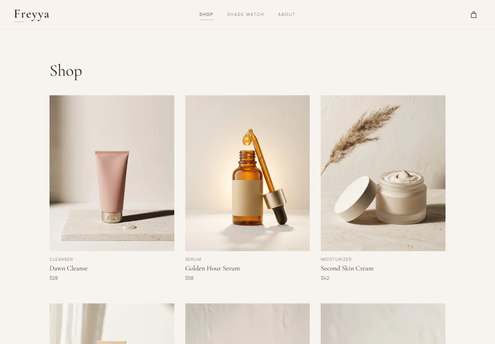
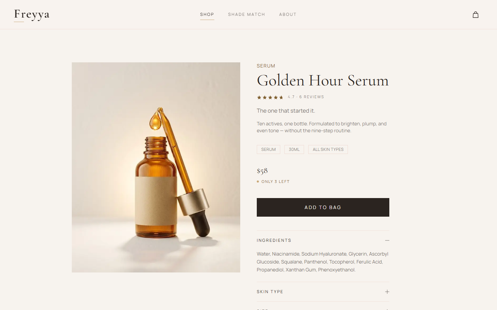
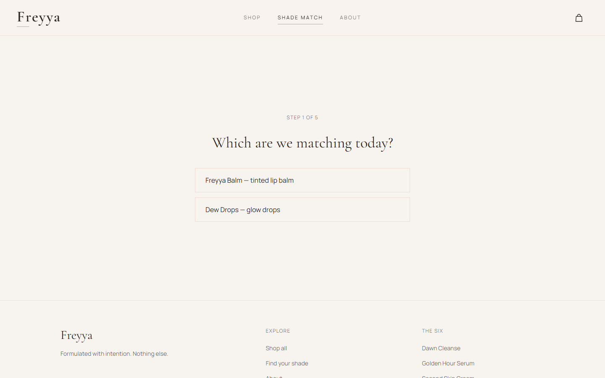

# Freyya

Your skin, but better.

Freyya is a storefront for a six-product skincare line. It is built with Next.js and designed to feel calm and expensive: quiet type, generous space, and motion that stays out of the way.

The catalog, orders and stock come from a separate API, in [`../Backend`](../Backend/README.md). This folder is the storefront and the admin dashboard.


## What's in it

- **A shade quiz.** Five questions match a visitor to one shade of the lip balm or the glow drops.
- **A shop with filter and sort.** Filter by skincare or color and sort by price or name. The choice is kept in the URL, so it survives a reload and can be shared.
- **Product pages.** Each product has ingredients, skin types, size and usage, live stock, ratings and reviews, and related products.
- **Reviews.** Seeded reviews plus a form for writing your own, saved on the device.
- **A persistent bag.** The cart survives reloads and stays in sync across tabs. Quantities are capped at stock.
- **A real checkout, with simulated payment.** Contact, delivery and shipping details place an order through the API, which checks and reserves the stock. Payment is a simulated step, so nothing is charged and no card data is collected.
- **An admin dashboard** at `/admin`. Sign in to see orders and revenue, move orders from paid to shipped to delivered, cancel them (which returns the stock), and restock or correct inventory with a history of every change.
- **An accessible cart drawer.** It behaves like a real modal dialog: focus moves in, stays in, and returns when it closes.
- **A newsletter field.** In the footer, demo-only: it checks the address and saves nothing.
- **Help pages.** Contact, shipping and returns, privacy and terms. The shipping page reads its prices and countries from the same data as checkout, so the two can't disagree.
- **Search-ready pages.** Per-page metadata, share images, product structured data, a sitemap and `robots.txt`.

|  |  |
| --- | --- |
|  |  |



## Stack

- Next.js 16 (App Router) and React 19
- TypeScript
- Tailwind CSS 4
- GSAP with ScrollTrigger and Flip for motion
- Lenis for smooth scrolling
- Vitest for tests
- Cormorant Garamond and Manrope through `next/font`

## Getting started

You need Node.js 20 or newer, and the API running. Start it first: see [`../Backend/README.md`](../Backend/README.md). By default it listens on port 4000.

```bash
npm install
npm run dev
```

Open [http://localhost:3000](http://localhost:3000). The admin is at [/admin](http://localhost:3000/admin).

If the API is down, the site still opens, using a bundled copy of the catalog. Ordering and the admin won't work until it is back.

| Command | What it does |
| --- | --- |
| `npm run dev` | Start the dev server |
| `npm run build` | Create a production build |
| `npm start` | Serve the production build |
| `npm run lint` | Run ESLint |
| `npm test` | Run the unit tests |

### Environment

| Variable | Purpose |
| --- | --- |
| `API_URL` | Where the API runs. Default `http://localhost:4000`. Read when the app builds and starts, so set it before `npm run build` on a host. |
| `NEXT_PUBLIC_SITE_URL` | The public address, for example `https://freyya.example`. Used for the sitemap and share links. Falls back to the Vercel production URL, then to `http://localhost:3000`. |
| `NEXT_PUBLIC_CONTACT_EMAIL` | Optional. When set, the contact page also shows this address as a mail link. |

## How it works

### The shade quiz

The first answer picks the product, Freyya Balm or Dew Drops. The next three answers are undertone clues: wrist veins, jewelry metal and sun response. Each answer votes for cool, warm or neutral, and the majority wins. A three-way tie goes to cool.

The last answer sets intensity, subtle or bold. The result is the shade with the winning undertone and the chosen intensity. If that combination doesn't exist, for example there is no bold cool Dew Drops shade, it falls back to the other shade in the same undertone.

The logic lives in `lib/quiz.ts`, and every possible combination of answers is tested to land on a real shade.

### Talking to the API

The browser never calls the API directly. It calls `/api/*` on the storefront's own address, and Next forwards those requests to `API_URL` (see `next.config.ts`). That keeps everything same-origin, so the admin session cookie is a plain first-party cookie and the API doesn't need to be exposed to arbitrary sites.

Pages read the catalog on the server, from the API, and refresh it every 30 seconds. The layout hands that list to the browser, so the bag, the quiz result and the product pages all see the same catalog. A shopper can briefly see a stale stock count, which is why checkout never relies on it: the server checks stock again when the order is placed.

### The bag

The cart is stored in `localStorage` and read through `useSyncExternalStore`, so it updates in other tabs through the `storage` event.

A saved cart is never trusted. Whenever it is read, each line's name, price, image and stock are re-derived from the current catalog. Unknown products and shades are dropped, and quantities are clamped between one and the available stock. If storage is blocked, the bag keeps working in memory for the session.

### Checkout

Placing an order sends the API what to buy and where to send it, and nothing about price. The server works out the totals. Each attempt carries an `Idempotency-Key`, so if the connection drops and the shopper tries again, they get the same order back instead of a second one. Changing anything in the form starts a fresh attempt.

If the server refuses, the shopper is told why in plain words. When stock ran short, the message says how many are left and the bag is corrected to match. Validation errors from the server are shown on the fields they belong to.

### The admin

`/admin` is a set of server-rendered pages that call the admin API with the visitor's session cookie. Without a session, they send you to the sign-in page and render nothing. Actions such as changing an order's status or adjusting stock call the API from the browser and then refresh the page. The admin has none of the storefront's header, footer or bag, and is kept out of search results.

### Motion

- Every animation checks `prefers-reduced-motion` first. Visitors who opt out get a static site.
- The shop-to-product transition uses GSAP Flip to move the photo from the card into place.
- The product photo stays in view with CSS `position: sticky`, not a scroll pin. Pinning made route changes fragile, and sticky needs no JavaScript.
- Lenis runs in native-scroll mode. It re-measures when the page height changes, and it is paused while the cart drawer is open.

### Accessibility

- A skip link and a visible gold focus ring on every interactive element.
- The cart drawer is a `role="dialog"` with `aria-modal`. While it is open the rest of the page is `inert`, Tab wraps inside it, Escape closes it, and focus goes back to the bag button.
- Form fields have labels, and errors are announced and linked to their field.
- Text meets WCAG AA contrast. Small gold text uses a deeper gold (`--color-accent-deep`) because the brand gold is too pale on the cream background. The brighter gold is kept for lines and fills.

### Performance

Images are visible in the server-rendered HTML, so they can paint before any script runs. An image that is still downloading when the page hydrates fades in over a skeleton instead. Above-the-fold photos are preloaded.

Lighthouse, run locally against a production build with the default mobile settings (simulated slow 4G and a 4x CPU slowdown):

| Page | Performance | Accessibility | Best practices | SEO |
| --- | --- | --- | --- | --- |
| Home | 92 | 100 | 100 | 100 |
| Shop | 92 | 100 | 100 | 100 |
| Product | 95 | 100 | 100 | 100 |
| Quiz | 95 | 100 | 100 | 100 |

Home scores 98 on desktop. Performance moves by several points between runs, so read these as ranges, not exact figures. The checkout is deliberately excluded from search, which is why it scores lower on SEO.

### Tests

`npm test` runs 81 tests covering:

- quiz scoring
- shop filtering, sorting and how the choice is read from and written to the URL
- cart stock limits, persistence, and recovery from a tampered, outdated or corrupted saved cart
- checkout requests, and how each kind of server error is turned into a message and a fix
- shipping and order totals, including the free-shipping threshold
- review averages and ordering
- catalog integrity, such as unique ids and valid related products

## Project structure

```
app/            Routes, metadata, share images, sitemap and robots
app/admin/      The admin dashboard
assets/         Fonts used to draw the share images and icons
components/     UI components
components/admin/  Admin UI
data/           Seeded reviews, and a copy of the catalog used as a fallback and in tests
lib/            Catalog, cart, checkout, orders, quiz, reviews and shared helpers
tests/          Unit tests
docs/           Screenshots used in this README
public/         Photography
```

## Limits

Freyya is a demonstration store.

- Payment is simulated. Nothing is charged, and no card details exist anywhere.
- Orders are real records with real stock effects, but nobody ships them and no emails are sent.
- Reviews are still saved in the visitor's browser only, and the contact form and newsletter field discard what you type.
- There is one admin, set in the API's environment. There are no customer accounts.

## Deploying

The storefront lives in the `Frontend` folder of the repository, and needs the API running somewhere it can reach.

1. Deploy the API first, and note its address. See [`../Backend/README.md`](../Backend/README.md).
2. On Vercel, set **Root Directory** to `Frontend`, and set `API_URL` to the API's address. Set `NEXT_PUBLIC_SITE_URL` once you have a domain.
3. On the API, set `CORS_ORIGINS` to the storefront's address, and `TRUST_PROXY=true` if it sits behind a proxy.

## License

MIT. See [LICENSE](../LICENSE).
