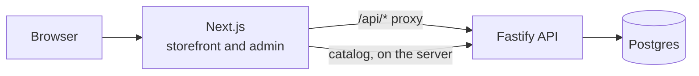

# Freyya

Your skin, but better.

Freyya is a full-stack skincare store: a storefront designed to feel calm and expensive, an API that owns the catalog, orders and stock, and an admin dashboard to run it.


It is a portfolio project, so payment is simulated. Everything else is real: orders are stored, stock is reserved and released, and the admin works on live data.

## Screenshots

| Shop | Product |
| --- | --- |
|  |  |

| Admin overview | Admin orders |
| --- | --- |
|  |  |


## What's in the repo

| | |
| --- | --- |
| [`Frontend`](Frontend/README.md) | The storefront and the admin pages. Next.js, React, TypeScript, Tailwind, GSAP. |
| [`Backend`](Backend/README.md) | The API. Fastify, TypeScript, Drizzle and Postgres. |

Each folder has its own README with the details. This one is the tour.

## How the pieces fit



The browser only ever talks to the storefront's own address. Requests to `/api/*` are forwarded to the API, which keeps the admin session cookie same-origin and keeps the API out of the browser's reach. Pages read the catalog on the server and refresh it every 30 seconds.

## What it does

**For shoppers**
- A shade quiz that matches a visitor to one shade of the lip balm or the glow drops.
- A shop with filter and sort, product pages with ingredients, stock and reviews, and a persistent bag.
- A checkout that places a real order. The server prices it, reserves the stock and takes a simulated payment.

**For the owner**
- An admin dashboard with revenue, orders by status, and what is running low.
- Move orders from paid to shipped to delivered, or cancel them and put the stock back.
- Restock or correct inventory, with a history of every change and who made it.

## The parts worth a look

**Stock can't be oversold.** An order locks the rows for its items, checks stock and takes it in one transaction, and the database itself refuses a negative count. A test has ten buyers race for three units and gets exactly three orders and seven refusals.

**The server decides prices.** The browser sends items and quantities, nothing else. Totals, shipping and the free-shipping rule are worked out server-side, in whole cents.

**A retry is safe.** Each checkout attempt carries an idempotency key. If the connection drops and the shopper tries again, they get the same order back, even when two copies of the request land at the same moment.

**Unpaid orders don't hold stock forever.** They reserve it for a limited time, then a sweep cancels them and returns the stock. Paying after the hold has run out fails cleanly.

**Every change to stock is recorded.** An item's history always adds up to its count.

**The admin is locked down properly.** Salted scrypt password hash, http-only session cookies with only a hash of the token stored, identical answers for a wrong email and a wrong password, rate-limited sign-in, and writes refused from unknown origins.

**The storefront keeps working if the API doesn't.** The catalog falls back to a bundled copy so pages still open. The bag re-checks every saved item against the current catalog, so a tampered or outdated cart can't carry a wrong price or stock level.

**Built to be used by everyone.** A modal cart drawer with a focus trap, keyboard-operable menus, WCAG AA contrast, and motion that switches off for visitors who ask for less of it.

**Tested.** 165 tests: 84 for the API, run against a real database, and 81 for the storefront's logic.

## Running it locally

You need Node.js 22.9 or newer and a Postgres database. The project uses [Neon](https://neon.tech), whose free tier is enough.

```bash
npm run install:all
```

Set up the API. Copy `Backend/.env.example` to `Backend/.env`, then fill in `DATABASE_URL`. For the admin login, make a password hash and put it in `ADMIN_PASSWORD_HASH`, along with `ADMIN_EMAIL`:

```bash
npm run admin:hash -- "a password of at least 12 characters"
```

Create the tables and load the six products:

```bash
npm run db:migrate
npm run db:seed
```

Then start both, in two terminals:

```bash
npm run dev:api
npm run dev:web
```

Open [http://localhost:3000](http://localhost:3000) for the store and [http://localhost:3000/admin](http://localhost:3000/admin) for the dashboard.

### Commands

| Command | What it does |
| --- | --- |
| `npm run install:all` | Install both packages |
| `npm run dev:api` | Start the API on port 4000 |
| `npm run dev:web` | Start the storefront on port 3000 |
| `npm run db:migrate` | Create or update the database tables |
| `npm run db:seed` | Load the launch catalog. Safe to repeat |
| `npm run admin:hash` | Make a password hash for the admin login |
| `npm run typecheck` | Type-check both packages |
| `npm run lint` | Lint the storefront |
| `npm test` | Run all tests |
| `npm run build` | Build both packages |

The API's tests wipe their tables, so they need a separate throwaway database in `Backend/.env.test`. See [`Backend/README.md`](Backend/README.md#tests).

## Repository layout

```
Frontend/    The storefront and admin dashboard
Backend/     The API, migrations and tests
docs/        Screenshots used in this README
LICENSE
```

## What it isn't

- Payment is simulated. Nothing is charged, and no card details exist anywhere.
- Nobody ships the orders, and no emails are sent.
- Reviews are still saved in the visitor's own browser, and the contact form and newsletter field discard what you type.
- There is one admin, set in the API's environment, and no customer accounts.

## License

MIT. See [LICENSE](LICENSE).
