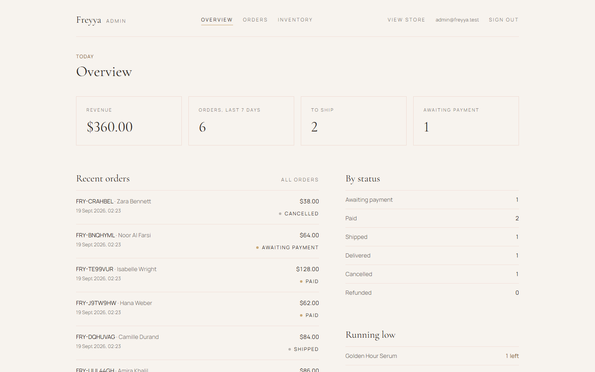
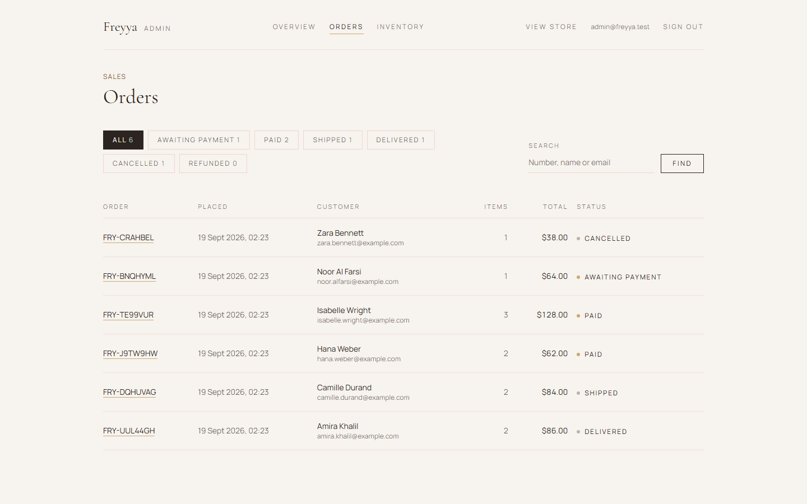
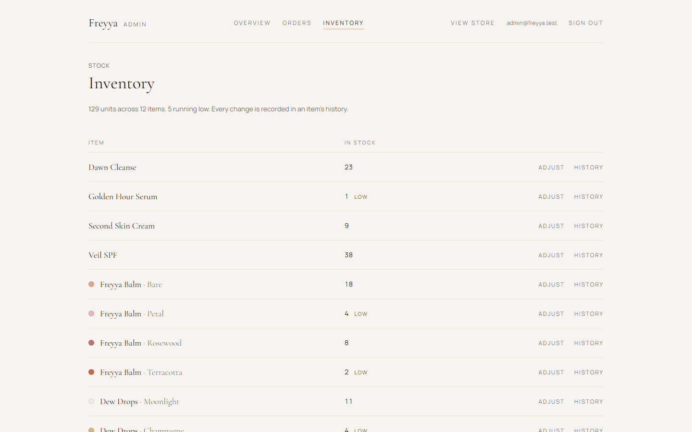
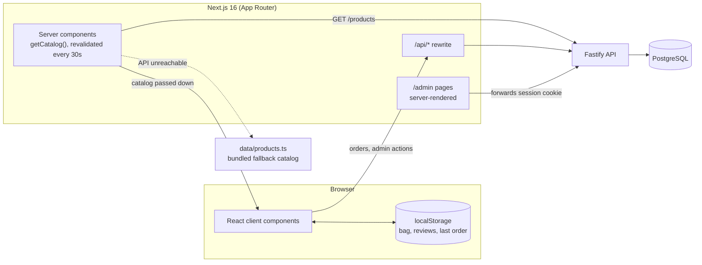
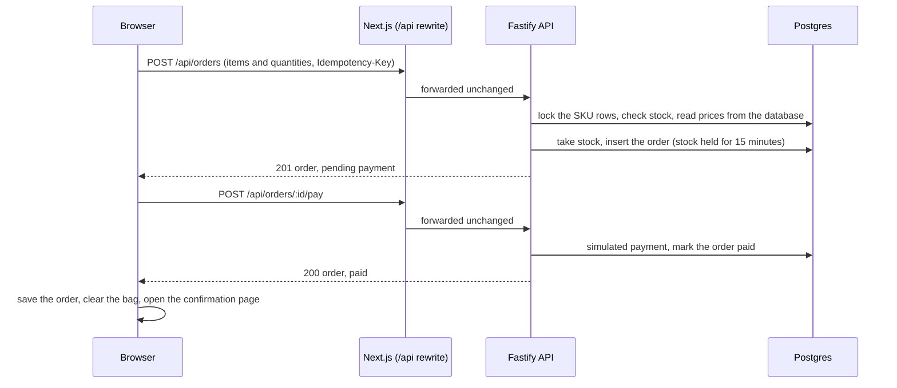

# Freyya

[](https://github.com/alieldeenahmed/Freyya/actions/workflows/ci.yml)

**A luxury skincare storefront, built as a frontend engineering and product design project, with a real API and admin dashboard behind it.**

Freyya sells six products in a calm, editorial interface: scroll-driven product stories, a shade-matching quiz, a persistent bag, and a checkout that places real orders against a backend. Payment is simulated. Everything else, including stock, orders and the admin, runs against a real database when the API is running.


## Overview

Freyya is a small e-commerce experience for an invented skincare brand. Its main job is to show what a polished, production-style storefront takes to build: a consistent visual system, deliberate motion, state that survives reloads, accessible interaction patterns, and a checkout that copes with things going wrong.

What it demonstrates:

- **Frontend engineering.** Next.js App Router, React 19 and strict TypeScript, with a hand-built design system on Tailwind CSS 4 and no component library.
- **Interaction design.** GSAP and Lenis for scroll-driven sections, a shared-element transition between the shop and product pages, and micro-interactions that all switch off for visitors who ask for reduced motion.
- **Product thinking.** A shade quiz, stock-aware product pages, a bag that re-checks itself against the catalog, and error messages written for shoppers, not developers.
- **A working backend.** An API that prices orders on the server, cannot oversell stock, and survives retried requests, plus an admin dashboard to run the shop.

It is a portfolio project, not a hosted business: nothing is really charged, nobody ships the orders, and no emails are sent.

## Live Demo

**https://freyya.vercel.app/**

The storefront is deployed on Vercel. **The API is not deployed**, so this deployment has no backend behind it (`/api/*` requests fail on the live site). In practice:

- Browsing works: the shop, product pages, the Shade Match quiz, the bag, the About and policy pages. The catalog comes from the bundled copy in `Frontend/data/products.ts`.
- Placing an order and signing in to `/admin` do not work there. To see them, run the project locally (see [Getting Started](#getting-started)). The admin screenshots below come from a local run.

## Screenshots

| Shop | Product |
| --- | --- |
|  |  |


**Admin dashboard** (local run, demo data)

| Overview | Orders |
| --- | --- |
|  |  |



## Key Features

**Storefront**

- **Home.** A hero, then three scroll-driven product sections. Each one pins a product image in place with CSS `position: sticky` while a scrubbed GSAP timeline crossfades three photographs ("The formula", "The texture", "The finish"), then a brand-values section.
- **Shop.** Filter by *All / Skincare / Color* and sort by featured, price or name. The choice lives in the URL (`/shop?group=color&sort=price-asc`), so it survives a reload and can be shared. Unknown values fall back to the default view.
- **Product pages.** Shade swatches that cross-fade the gallery photo, a live stock line ("Only 3 left" at five or fewer, "Sold out" at zero), an accordion for ingredients, skin type, size and usage, an average rating that scrolls to the reviews, and related products.
- **Add to bag feedback.** A gold wipe sweeps across the button, the bag badge rolls to the new count, and a small self-dismissing note appears beside the bag. Nothing opens automatically and nothing needs closing.
- **Reviews.** 32 seeded reviews plus a form to write your own: a keyboard-operable star picker, validation, and a cap on lengths. Your reviews are saved in your browser and merged into the list and the average.
- **Shade Match.** Five questions that resolve to one shade of the lip balm or the glow drops. See [Shade Match](#shade-match).
- **Bag.** A drawer that behaves like a real modal dialog, with quantities capped at stock and a free-shipping hint.
- **Checkout.** Contact, delivery and shipping method, sent to the API. See [Commerce](#product--commerce-architecture).
- **Content and policy pages.** About, contact, shipping and returns, privacy, terms. The shipping page reads its prices and countries from the same module the checkout uses, so the two cannot disagree.
- **Small pieces.** A custom, keyboard-accessible dropdown used in four places, a footer newsletter field (demo-only), and custom 404, error and loading pages.

**Admin dashboard (`/admin`)**

- An overview with revenue, orders by status and low-stock items.
- An orders list with status filters, search and paging, and an order detail page with a timeline.
- Status actions that follow the order lifecycle (paid, shipped, delivered), plus cancel, which returns the stock to the shelf.
- Inventory: restock or correct any item, and read its history of changes (the latest 50 per item), each with the reason, the note, who made it, and a link to the order that caused it.

## User Experience

1. **Arrive.** The hero text animates in with a CSS animation that starts on the first paint, so it does not flash before it animates.
2. **Browse.** Scroll the home page's product stories, or open the shop and filter or sort.
3. **Inspect.** Click a product card. The card's photograph travels to its place on the product page instead of the page simply changing.
4. **Choose a shade.** Pick a swatch, or take the Shade Match quiz to be pointed to one.
5. **Add to bag.** The button confirms with the gold wipe, and the bag badge updates.
6. **Review the bag.** Open the drawer to change quantities or remove items. Refreshing the page, or opening a second tab, keeps the bag.
7. **Check out.** Fill in the form. If stock ran out in the meantime, the page says how many are left and corrects the bag.
8. **Confirm.** The confirmation page shows the order number, address and totals, and it still works after a refresh.

## Technical Architecture



- The **browser never calls the API directly**. Actions go to `/api/*` on the storefront's own address, and `next.config.ts` rewrites those requests to the API. That keeps the admin session cookie same-origin.
- **Server components fetch the catalog** and hand it to the browser through a context provider. If the API cannot be reached, they fall back to the bundled catalog so the site still opens.
- **The bag, your reviews and the last order live in `localStorage`**, not on the server.
- **Admin pages render on the server** and call the admin API with the visitor's session cookie. Without a session they redirect to the sign-in page and render no data.

How a checkout travels:



## Frontend Architecture

- **Framework.** Next.js 16.3 with the App Router and React 19. Turbopack is the default toolchain in this version. There is no Vite.
- **Routing.** 16 routes under `Frontend/app`: the storefront (`/`, `/shop`, `/shop/[id]`, `/quiz`, `/about`, `/checkout`, `/checkout/confirmation`, `/contact`, `/privacy`, `/terms`, `/shipping-returns`) and the admin (`/admin`, `/admin/login`, `/admin/orders`, `/admin/orders/[id]`, `/admin/inventory`). Custom `not-found`, `error`, `global-error` and `loading` files.
- **Server and client split.** Pages, the catalog, the footer, metadata and the admin are server components. Anything with state or animation is a client component.
- **State management.** No state library. There are three kinds of state:
  - *Catalog:* fetched on the server, exposed through `CatalogProvider` and `useCatalog()`.
  - *Persistent browser state:* the bag (`freyya:cart`), your reviews (`freyya:reviews`) and the last order (`freyya:last-order`), each a small module read with `useSyncExternalStore`. Each returns the same cached value until the stored value changes, so React sees a stable snapshot. They sync across tabs through the `storage` event and fall back to memory if storage is blocked.
  - *Local UI state:* ordinary `useState` for forms, the quiz, drawers and menus.
- **Data handling.** `lib/catalog.ts` fetches and validates the catalog. `lib/api.ts` is a small typed client that turns API failures into an `ApiError`. `lib/checkout.ts` builds order requests and turns each kind of failure into a message and a fix.
- **Reusable pieces.** `Reveal` (scroll-triggered fade-in), `FadeImage`, `Field` and `fieldClass` (form inputs), `Select` (dropdown), `PolicyPage`, `ProductCard`, `ProductGrid`, `OrderSummary`, `StatusBadge`, and hooks such as `useMagnetic` and `useHydrated`.
- **Quality tooling.** Strict TypeScript, ESLint with `eslint-config-next`, Vitest with Testing Library, Playwright with axe, and CI on GitHub Actions.

## UI / Design System

The design system is a set of tokens plus conventions, written directly in Tailwind CSS 4 with no UI library.

- **Colour tokens** (`app/globals.css`, exposed through `@theme`): base `#f7f3ee`, accent gold `#c9a876`, a deeper gold `#7f6030` for small text (the brand gold is too pale to read on the cream base), secondary blush `#e8c4b8`, text `#2b2420`. Gold is kept for lines, fills and hover states.
- **Typography.** Cormorant Garamond (400, 500, 600) for headings, prices and product names, and Manrope for interface text, both loaded through `next/font` and exposed as `font-serif` and `font-sans`. Small labels are uppercase with wide letter-spacing.
- **Surfaces.** Hairline borders (`border-secondary/40`), flat cards, no rounded corners on containers, and a soft shadow reserved for floating panels.
- **Interactive patterns.** Solid dark buttons that turn gold on hover, outlined secondary buttons, underline-style form fields, and a single focus style: a 1px gold outline with an offset.
- **Placeholders.** A `.skeleton` class with a shimmer, shown behind every photograph until it loads.
- **Motion.** Eased movements over short distances (typically 8 to 24 pixels of travel). Every animation is gated by `prefersReducedMotion()` in JavaScript or a `prefers-reduced-motion` rule in CSS.
- **Lining numerals in admin.** Cormorant's default old-style figures make a "1" look like an "I", so dashboard figures use `lining-nums`.

## Product / Commerce Architecture

**Product model** (`lib/types.ts`). A `Product` has an id, name, category (`Cleanser`, `Serum`, `Moisturizer`, `SPF`, `Lip Balm`, `Highlighter`), tagline, description, price, specs, a brand colour, images, `details` (ingredients, skin types, size, usage) and related product ids. Products with shades have `variants`, each with a hex colour, image, stock, `undertone` (cool, warm, neutral) and `intensity` (subtle, bold). Stock lives on the product, or on each variant when there are shades.

The catalog is six products and twelve stock-keeping units: four single products, plus the balm and the glow drops with four shades each.

**The bag** (`lib/cart-store.ts`, `lib/cart-context.tsx`). A line is `{ id, productId, variantId?, name, variantName?, price, color, image, stock, quantity }`. The line `id` is `productId` for a plain product and `productId:variantId` for a shade, and the same id is the stock key the API uses.

- `reconcileCart(items, catalog)` is a pure function that re-derives name, price, image and stock from the current catalog, drops unknown products and shades, and clamps each quantity between one and the available stock. It runs every time the bag is read, so a saved bag can never carry an outdated or tampered price.
- `withAdded`, `withQuantity` and `withoutItem` are pure functions that return a new list.
- `CartProvider` combines the stored lines with the catalog from `useCatalog()`.

**Money and shipping.** Prices are whole dollars in the browser. The API stores integer cents and returns dollars. Standard shipping is $6 and free from $75, and express is $14 (`lib/shipping.ts`). The browser calculates totals for display, and the server recalculates them, so its figures are the ones that count.

**Checkout.** The form is validated in the browser, then sent as items and quantities only, with an `Idempotency-Key` that changes whenever the shopper edits anything. Server errors map to fixes:

| Server answer | What the shopper sees |
| --- | --- |
| Not enough stock | "Golden Hour Serum: only 1 left." The bag is corrected to match. |
| Item no longer sold | It is removed from the bag, with an explanation. |
| Field validation | The message appears on the field it belongs to. |
| Rate limited, or connection lost | A plain retry message. The same key is reused, so a retry cannot create a second order. |

The confirmation page reads the last order from `localStorage`. With no order saved, it redirects to `/shop`.

## Shade Match

A five-question quiz at `/quiz` (nav label "Shade Match"). Logic is in `lib/quiz.ts`, and the interface is `components/Quiz.tsx`.

1. **Which product.** Freyya Balm (tinted lip balm) or Dew Drops (glow drops).
2. **Three undertone clues.** Wrist vein colour, jewellery metal, and how skin reacts to sun. Each answer votes for *cool*, *warm* or *neutral*.
3. **Intensity.** Barely there (*subtle*) or noticeable (*bold*).

`scoreQuiz(answers, products)` tallies the three undertone votes and takes the largest. Ties resolve in the order cool, warm, neutral. It then looks in the chosen product's variants for the winning undertone and intensity. If that exact combination does not exist (there is no bold cool Dew Drops shade, for example), it falls back to the same undertone at the other intensity, then to the product's first shade. Missing answers default to the balm, subtle.

The component keeps the step and answers in local state, derives the result during render, animates each step in and out with GSAP, and shows the matched shade's photograph with a link to that product's page. It reads the catalog from `useCatalog()`, so the result reflects the live catalog.

The result links to the product page but does not pre-select the shade there. All 108 answer combinations are covered by a test that asserts each resolves to a shade that exists.

## Responsive Design

The layout is mobile-first and uses two Tailwind breakpoints: `sm` (640px) and `lg` (1024px). There is no separate tablet layout, so tablets use the `sm` layout until 1024px.

| Width | What changes |
| --- | --- |
| Below 640px | Single column. The header shows a menu button that opens a nav panel. The product grid is one column, and the product page stacks photo above text. The bag drawer is full width, up to a maximum of 384px. |
| 640px and up | The header becomes a three-column grid with inline navigation. The shop grid is two columns, the product page is two columns with the photo sticky beside the text, and forms use two-column rows. |
| 1024px and up | The shop grid is three columns. Checkout adds a 400px order-summary column that stays in view, and the order confirmation adds a 400px summary column. |

Other techniques used:

- The hero uses `dvh` units, so it fits mobile browser chrome.
- `next/image` `sizes` attributes match the layout's real column widths.
- Icon buttons are 44 by 44 pixels.
- Wide admin tables scroll inside their own container instead of widening the page. This was verified at 375px.
- The header is sticky, and the mobile nav panel is animated with GSAP.

## Accessibility

Built for screen readers and keyboards, and checked with automated tests of the accessibility tree, focus and announcements (see below). Nobody has yet listened to the site with a real screen reader such as NVDA or VoiceOver, so no compliance claim is made.

- A skip-to-content link, `aria-current="page"` on the active nav link, one `main` landmark, and named navigations.
- **The bag button says how many items it holds** ("Cart, 2 items"). Adding an item is announced ("Freyya Balm, Petal, added to your bag") through a live region that is always on the page, because a region that starts out hidden is unreliable.
- **The bag drawer is a `role="dialog"` with `aria-modal`.** Opening it moves focus in, traps Tab, closes on Escape, marks the rest of the page `inert`, stops smooth scrolling and locks page scroll, and returns focus to the bag button on close. Items are a list. A quantity change or removal is announced with the product's name, and removing an item keeps focus inside the drawer instead of dropping it.
- **Forms.** Every field has a label. Errors use `role="alert"`, `aria-invalid` and `aria-describedby`. The checkout, contact, newsletter and review forms move focus to the first invalid field on submit. When the contact or newsletter form is sent, focus moves to the thank-you, since the form it was in is gone.
- **The star picker** is a `role="radiogroup"` where the arrow keys move focus and choose together, as a native radio group does. Displayed ratings are `role="img"` with a text label. The rating breakdown reads as sentences ("3 reviews with 5 stars"), not bare numbers.
- **Shade Match** moves focus to each new question and to the result, because the button just pressed disappears. Its answers are a group named by the question.
- **Shade swatches** are a group named by the shade label, and say which is pressed and which are sold out. Photographs of shades that are not showing are hidden from readers, and the stock line is announced when the shade changes.
- **The custom `Select`** is a listbox: `aria-haspopup`, `aria-expanded`, `aria-controls`, `aria-activedescendant`, arrow keys, Home and End, type-to-jump, and Escape.
- **The accordion** names each panel by its button, and closed panels are `inert`, so their text is not read and their contents cannot be tabbed to. Filter chips use `aria-pressed`.
- **The mobile menu** closes on Escape and hands focus back to its button.
- **The admin** gives each row's buttons the item's name ("Adjust stock, Second Skin Cream"), moves focus into and out of the stock form, asks before cancelling with the safe answer focused, and announces the result of an order change.
- Product cards are named once, by their heading. Their photographs are decorative.
- Images otherwise have descriptive `alt` text, or an empty one when purely decorative.
- **Reduced motion** is respected across GSAP (`prefersReducedMotion()`), CSS (`prefers-reduced-motion` and `motion-reduce:`), and smooth scrolling, which is not started at all.
- Text tones were checked against WCAG AA contrast ratios during development, which is why a separate deeper gold exists for small text. This was a calculation, not a formal audit.

**Automated checks.** Three kinds, all run in CI:

- **axe scans** of every page and the key interactive states, against the WCAG 2.0, 2.1 and 2.2 A and AA rules plus axe's best-practice rules. The states are the open bag drawer, an open dropdown, the review form, a quiz result, checkout with errors showing, and the admin pages. All pass, and a separate test proves the scanner reports real problems.
- **Accessibility-tree and focus tests** in a real browser, which check names, states, landmarks and where focus lands after each action.
- **Component tests** for the same behaviour, so a regression fails in seconds.

These read the information a screen reader is built from. They cannot tell whether an announcement is helpful or the reading order is pleasant. That takes a person with a screen reader, which has not been done, and [`docs/accessibility-testing.md`](docs/accessibility-testing.md) is the checklist for it.

## Performance

- **Images.** `next/image` with `sizes` attributes matched to the layout, and `priority` on the hero, the first three product cards, the first product photo and the About photo.
- **No blank images before hydration.** `FadeImage` renders photographs visible in the server HTML, and only hides and fades one in if it is still downloading when React hydrates. A commit in the history (`perf: show images before hydration…`) records this change.
- **Fonts.** Loaded through `next/font`, which self-hosts them.
- **Rendering.** The catalog fetch is cached and revalidated every 30 seconds, so the storefront pages are statically generated and refreshed in the background. The admin is the only dynamic part.
- **Layout stability.** The Suspense fallback on the shop renders the same markup as the real controls, the checkout pages reserve their height, and the hero text animates from CSS from the first paint.
- **Animation hygiene.** GSAP work is wrapped in `gsap.context()` and reverted on cleanup. Lenis is kept in sync with the page height through a `ResizeObserver`.

Lighthouse was run locally during development and its results are recorded in [`Frontend/README.md`](Frontend/README.md). There is no automated performance budget and no bundle analysis in the repository.

## Testing

There are three layers, and CI runs all of them.

**Storefront: 184 tests in 15 files** (Vitest, in `Frontend/tests`). Logic tests run in Node. Component tests render the real components in jsdom with Testing Library, with the network mocked.

| Area | What is checked |
| --- | --- |
| Shade Match | All eight shade outcomes, ties, fallbacks, defaults, and every one of the 108 answer combinations. The quiz component is tested from the first question to the result. |
| Bag | Stock limits per shade, persistence across a reload, and recovery from a tampered, outdated or corrupted saved bag. The drawer is tested as a modal: focus trap, Escape, inert background, quantities. |
| Checkout | Request building, and each kind of server error mapped to a message and a fix. The form is tested end to end against a mocked API: request contents, validation, stock refusals that correct the bag, field errors, and idempotency keys that are reused after a dropped connection and reset after a change. |
| Shop, product page, reviews | Filtering, sorting and the URL. Shade swatches and stock lines, star rating and review validation, the accordion, and the custom dropdown's keyboard behaviour. |
| Catalog, reviews, totals | Data integrity, average and distribution, and the free-shipping threshold. |

**API: 88 tests in 6 files**, run against a real Postgres database, including ten buyers racing for three units (exactly three orders succeed), idempotent retries, reservation expiry, admin sign-in and sessions, order status rules, and stock adjustments. The API tests wipe their tables, so they run on a separate database, and they refuse to run if it matches `DATABASE_URL`. See [`Backend/README.md`](Backend/README.md#tests).

Four of them are **contract tests**. The storefront and the API each keep their own copy of the shipping rules and the catalog, so that either can be deployed alone. These tests read the storefront's files and fail as soon as the two copies stop agreeing.

**End to end: 71 tests in 6 files** (Playwright), against a production build of the storefront, the real API and a throwaway database, on desktop Chrome and a 375 pixel phone:

- Browsing, filtering, the bag and Shade Match.
- A real purchase, checked against the API afterwards, and a refused order.
- The admin: signing in, shipping an order, cancelling one and seeing its stock return, restocking, and refusing negative stock.
- Layout on a phone: no sideways scrolling on any page, the menu, the drawer and the stacked layouts.
- The automated accessibility scans, and tests of names, focus and announcements in the accessibility tree, both described above.

```bash
npm test                # storefront and API tests
npm run test:e2e        # end-to-end tests (needs Backend/.env.test)
```

**Continuous integration.** `.github/workflows/ci.yml` runs on every push to `main` and every pull request. It checks the storefront (lint, type-check, tests, build) and the API (type-check, build, migrations on an empty Postgres, tests), then runs the end-to-end suite. The workflow was validated and its first two jobs were reproduced from a clean checkout, but the end-to-end job has not yet run on GitHub's own runners. There is no automatic deployment.

Not covered: a manual screen-reader pass, and real-device testing beyond the emulated phone.

## Project Structure

```text
Freyya/
├── Frontend/                Next.js storefront and admin
│   ├── app/                 Routes, metadata, share images, sitemap, robots
│   │   └── admin/           Admin dashboard pages
│   ├── components/          UI components
│   │   └── admin/           Admin UI
│   ├── lib/                 Catalog, bag, checkout, quiz, shop view, API client
│   ├── data/                Bundled catalog (fallback and test fixture), seeded reviews
│   ├── tests/               Logic and component tests (Vitest)
│   ├── e2e/                 End-to-end and accessibility tests (Playwright)
│   ├── public/              Product and hero photography
│   ├── assets/fonts/        Fonts used to draw share images and icons
│   └── docs/screenshots/    Storefront screenshots
├── Backend/                 Fastify API
│   ├── src/                 Routes, services, domain rules, database
│   ├── drizzle/             Generated SQL migrations
│   ├── tests/               Integration and unit tests
│   └── scripts/             Admin password helper
├── .github/workflows/       CI
├── docs/                    Admin screenshots, accessibility checklist
└── package.json             Root scripts that drive both packages
```

## Tech Stack

| Technology | Purpose |
| --- | --- |
| Next.js 16, React 19 | Storefront and admin (App Router, server components, Turbopack) |
| TypeScript (strict) | Both packages |
| Tailwind CSS 4 | Styling and design tokens |
| GSAP (ScrollTrigger, Flip) | Scroll-driven sections, shared-element transition, micro-interactions |
| Lenis | Smooth scrolling |
| Fastify 5 | API |
| Drizzle ORM, `pg` | Database access and SQL migrations |
| PostgreSQL | Data (developed against Neon) |
| Zod | Request and environment validation |
| Vitest, Testing Library, jsdom | Unit, integration and component tests |
| Playwright, axe-core | End-to-end tests and automated accessibility scans |
| GitHub Actions | CI |
| ESLint (`eslint-config-next`) | Storefront linting |

The storefront's only runtime dependencies are `next`, `react`, `react-dom`, `gsap` and `lenis`.

## Engineering Decisions

| Decision | Why it appears to have been made | Trade-off |
| --- | --- | --- |
| Catalog comes from the API, with a bundled fallback | A code comment says the site should stay browsable if the API is down. | The bundled copy can be out of date, and the same catalog also exists as backend seed data. |
| Bag re-checked against the catalog on every read | A comment says a saved bag must never carry an outdated price, image or stock level. | The catalog has to be available in the browser, which is why it goes through a context provider. |
| Browser calls `/api/*` and Next rewrites it to the API | A comment in `next.config.ts` says this keeps the admin cookie same-origin. | The storefront host needs the API address at build time. |
| Local stores read through `useSyncExternalStore` with cached snapshots | The code keeps the same value until the stored one changes, which is what `useSyncExternalStore` needs for a stable snapshot, and it adds cross-tab sync through the `storage` event. The comments give no further reason. | A small amount of hand-written store code, repeated for three stores. |
| Shop-to-product transition uses a "ghost" copy and `Flip.fit` | A comment says a fixed copy means the grid never reflows and the text column stays put. | It is bespoke code that has to handle slow image loads and reduced motion. |
| Custom `Select` instead of the browser's | Branded, consistent dropdowns (commit: "replace native dropdowns with a branded select"). | Browser autofill no longer fills the country field, and keyboard and screen-reader behaviour is now code to maintain. |
| Simulated payment behind a `PaymentProvider` interface | A comment marks it as the seam for a real provider. | The most visible part of a real checkout is faked. |
| The API sets prices, and the browser sends only items and quantities | Tests and comments assert that client prices are ignored. | The shipping rules and the catalog exist in both packages. A contract test fails if they differ, but they are still two copies. |
| Showcase sections use CSS `sticky` plus a scrubbed timeline | The git history shows an earlier version used a GSAP pin, replaced during a "responsive and performance pass". The commits do not record why. | The section height is set from JavaScript. |

## Challenges & Solutions

- **Smooth scroll fought client-side navigation.** Lenis caches the page height, so a page that changed length after a navigation could not be scrolled. The fix is a `ResizeObserver` on `<body>` that re-measures, plus a scroll reset on every route change.
- **A shared-element transition that never flashes.** Moving a card's photograph to the product page had to hide the real image until the copy landed, wait for the real image to load, and skip entirely for reduced motion or a stale record (older than four seconds). The card writes its position to `sessionStorage`, and the product page reads it before paint.
- **Stock changes between page load and checkout.** The catalog can be up to 30 seconds old. Rather than trusting it, the server re-checks stock and returns exactly what is available, and the bag is corrected to match.
- **Double submits and dropped connections.** Each attempt carries an idempotency key that resets when the form changes, and the API returns the original order for a repeated key, even when two identical requests arrive at once.
- **Two people buying the last unit.** The API locks the stock rows in a fixed order inside one transaction, and the database itself refuses a negative count. A test covers it.
- **localStorage data on a server-rendered page.** The checkout renders only its heading until the browser has hydrated (`useHydrated`), so the empty-bag message is not shown before the saved bag has been read.
- **A modal that really is modal.** The drawer makes the rest of the page `inert`, traps focus, stops smooth scrolling, and restores all of it on close.
- **Layout shift from a client-only filter.** The shop's Suspense fallback renders the same controls as the real component.
- **A 404 page that answered 200.** The end-to-end tests found that an unknown product address showed the not-found design but returned HTTP 200, a "soft 404" for search engines. Once a response has started streaming its status cannot change. The fix is `dynamicParams = false` on the product route, so an unknown id is a real 404. The trade-off is that a product added after the last build has no page until the storefront is rebuilt. A test guards the 404.
- **The add-to-bag feedback took three tries.** The history shows a fly-to-bag animation, then a gold-dust glide, then the current gold wipe with a rolling count and a note. The commits do not record the reasoning.

## Getting Started

**Prerequisites:** Node.js 22.9 or newer, which the API requires. The storefront on its own needs only what Next.js 16 supports, which is Node.js 20.9 or newer. The full stack also needs a Postgres database. [Neon](https://neon.tech) has a free tier.

```bash
git clone https://github.com/alieldeenahmed/Freyya.git
cd Freyya
```

### Storefront only

No database is needed. The catalog comes from the bundled copy, and a warning about that appears in the terminal. Ordering and the admin will not work.

```bash
cd Frontend
npm install
npm run dev
```

Open [http://localhost:3000](http://localhost:3000).

### Full stack

```bash
npm run install:all
```

Copy `Backend/.env.example` to `Backend/.env` and set `DATABASE_URL`. For the admin login, make a password hash, then put it in `ADMIN_PASSWORD_HASH` along with `ADMIN_EMAIL`:

```bash
npm run admin:hash -- "a password of at least 12 characters"
```

Create the tables, load the six products, and start both servers in two terminals:

```bash
npm run db:migrate
npm run db:seed
npm run dev:api        # API on http://localhost:4000
npm run dev:web        # storefront on http://localhost:3000
```

The admin is at [http://localhost:3000/admin](http://localhost:3000/admin).

### Commands

| Command | What it does |
| --- | --- |
| `npm run install:all` | Install both packages |
| `npm run dev:api`, `npm run dev:web` | Start the API, or the storefront |
| `npm run db:migrate`, `npm run db:seed` | Create tables, load the launch catalog (safe to repeat) |
| `npm run admin:hash` | Make a password hash for the admin login |
| `npm run typecheck` | Type-check both packages |
| `npm run lint` | Lint the storefront |
| `npm test` | Run the storefront and API tests (the API tests need `Backend/.env.test`) |
| `npm run test:e2e` | Run the end-to-end tests (needs `Backend/.env.test`) |
| `npm run build` | Build both packages |

To preview a production build of the storefront: `npm --prefix Frontend run build`, then `npm --prefix Frontend start`.

## Environment Variables

**Storefront** (`Frontend/.env.example`). All are optional for local development.

| Variable | Purpose |
| --- | --- |
| `API_URL` | Where the API runs. Default `http://localhost:4000`. Read when the app builds and starts. |
| `NEXT_PUBLIC_SITE_URL` | The public address, for the sitemap and share links. Falls back to the Vercel production URL, then to `http://localhost:3000`. |
| `NEXT_PUBLIC_CONTACT_EMAIL` | If set, the contact page also shows this address as a mail link. |

**API** (`Backend/.env.example`)

| Variable | Purpose |
| --- | --- |
| `DATABASE_URL` | Postgres connection string. Required. |
| `PORT`, `HOST` | Where to listen. Defaults `4000` and `0.0.0.0`. |
| `CORS_ORIGINS` | Origins allowed to call the API, comma-separated. Default `http://localhost:3000`. |
| `ADMIN_EMAIL`, `ADMIN_PASSWORD_HASH` | The single admin login. Without them, admin sign-in answers 503. |
| `ADMIN_SESSION_HOURS` | Admin session length. Default 12. |
| `RESERVATION_MINUTES` | How long unpaid stock is held. Default 15. |
| `LOW_STOCK_THRESHOLD` | At or below this, an item is flagged as low. Default 5. |
| `RATE_LIMIT` | On by default. The end-to-end run sets `false`, so its own sign-ins are not throttled. Leave it on elsewhere. |
| `TRUST_PROXY` | Set to `true` behind a proxy, so rate limits see real client addresses. |

`Backend/.env.test` (git-ignored) holds `TEST_DATABASE_URL` for the API tests. No secrets are committed: `.env` files are ignored, and only the `.env.example` files are tracked.

## Deployment

- **Storefront.** Deployed on Vercel at https://freyya.vercel.app/. The repository holds no platform configuration file. [`Frontend/README.md`](Frontend/README.md) documents the setup: Root Directory `Frontend`, with `API_URL` set to the API's address at build time.
- **API.** Not deployed, which is why the live storefront has no backend. It is a plain Node service: build it with `npm run build`, run the migrations against the target database, then start it with `npm start`, with the environment variables above. Set `CORS_ORIGINS` to the storefront's address and `TRUST_PROXY=true` behind a proxy. See [`Backend/README.md`](Backend/README.md).
- CI runs on GitHub Actions (see [Testing](#testing)). There is no automatic deployment.

## Current Status

A polished portfolio project with a working backend, not a hosted business.

- Payment is **simulated**. Nothing is charged, and no card details exist anywhere.
- Orders are real records with real stock effects, but nobody fulfils them and no emails are sent.
- Reviews are saved in the visitor's own browser, and the contact form and newsletter field discard what you type.
- One admin, set in the API's environment. There are no customer accounts.
- The live deployment has the storefront only. The API and admin need a local run.

Limitations found during the audit:

- The bundled catalog, the API's seed data and the shipping rules exist in more than one place. Contract tests catch drift, but they are still copies.
- Only two responsive breakpoints. There is no dedicated tablet layout.
- No manual screen-reader pass has been done, and real-device testing goes no further than an emulated phone.
- The hero can play a background video, but none is supplied.

## Why This Project

Freyya shows the parts of frontend work that are easy to skip and hard to fake: a coherent design system built from tokens, motion that is coordinated and always optional, state that survives reloads and tabs without a state library, and interaction patterns (a modal drawer, a listbox, a radio-group rating) built to behave properly with a keyboard.

It also shows product judgement. The bag never trusts itself, checkout failures explain themselves, and the shade quiz is logic that is small enough to test exhaustively. Behind the interface, a real API keeps the shop honest when several people order at once: server-side prices, idempotent orders, stock that cannot be oversold, and an admin to run it.

## License

MIT. See [LICENSE](LICENSE).
